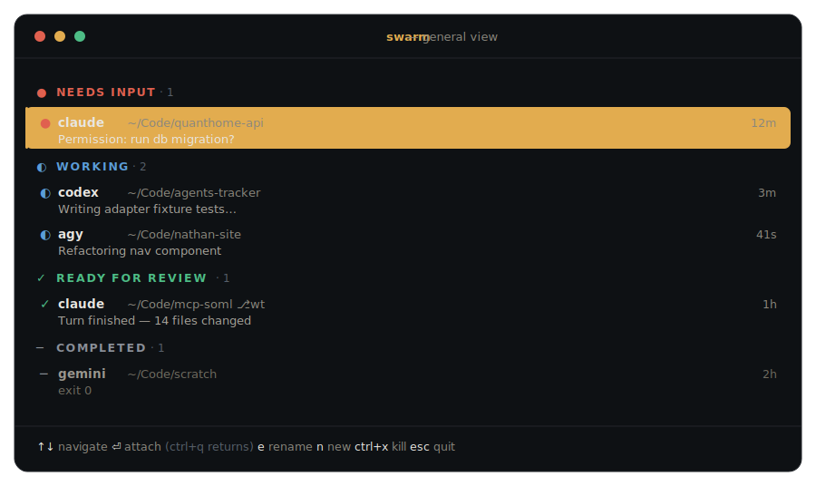

# swarm

> Every coding-agent CLI on your machine, in one keyboard-driven terminal dashboard — running in the background, surviving the terminal and the daemon.

[](https://github.com/Nathandela/swarm/releases)
[](https://go.dev/)


<p align="center">
  
</p>

swarm centralizes every coding-agent session on a machine — Claude Code, Codex, and more — into one Agent View-style dashboard. Sessions run in the background under a supervisor daemon, sort themselves by what they need from you, and are launched, attached, and killed entirely by keyboard. Close the terminal or upgrade the daemon, and the agents keep running.

Inspired by Claude Code's Agent View, but agent-agnostic.

## Why

Run more than one coding agent at once and they scatter across terminal tabs and windows. You can't see at a glance which one is blocked on a question, which is mid-task, and which just finished — and closing the wrong terminal kills a session outright.

swarm gives you:

- **One view for every agent.** Claude Code and Codex today, each behind a tested adapter; Gemini CLI, OpenCode, and more are on the roadmap.
- **Grouping by what needs you.** Sessions sort into _Needs input_, _Working_, _Ready for review_, and _Completed_, so the ones waiting on you stay on top.
- **Background by default.** Each session runs under its own process that owns the terminal (PTY). Close the tab and it keeps going.
- **Survival across daemon crash and upgrade.** `brew upgrade swarm` mid-run — the next daemon reconnects to your live sessions with nothing lost.
- **Keyboard-only flow.** Three screens, five keys.

## How it works

<p align="center">
  
</p>

One binary, a few roles. `swarm` is the TUI client; on first run it auto-starts `swarm daemon` in the background. The daemon supervises a tiny **shim** process per session — the shim owns the PTY, emulates the screen as a VT grid, and appends the transcript. Because the shims are separate processes, they outlive both your terminal and the daemon itself: a restarted daemon rebuilds its registry from each session's on-disk `meta.json` and reconnects, verifying process identity by PID plus start time (ADR-001).

Clients never talk to shims directly — everything goes through the daemon's protocol over a Unix socket. That protocol is the product's spine, kept evolvable for a future mobile client.

## Install

swarm ships as a single static binary with no runtime dependencies.

```sh
# Homebrew (macOS)
brew install --cask Nathandela/swarm/swarm

# go install (macOS or Linux)
go install github.com/Nathandela/swarm/cmd/swarm@latest
```

Or download a static binary for your platform from the [releases page](https://github.com/Nathandela/swarm/releases). Checksums and upgrade notes: [docs/install.md](docs/install.md).

Verify the install:

```sh
swarm version
```

## Quickstart

```sh
swarm
```

The daemon starts automatically the first time, and you land on the general view. From there, everything is five keys:

| Key | Action |
|-----|--------|
| <kbd>↑</kbd> <kbd>↓</kbd> | Move through the session list |
| <kbd>⏎</kbd> | Attach to the selected session — raw and full-screen (<kbd>ctrl</kbd>+<kbd>q</kbd> returns) |
| <kbd>n</kbd> | New session — pick an agent and a working directory |
| <kbd>e</kbd> | Rename the selected session |
| <kbd>ctrl</kbd>+<kbd>x</kbd> | Kill it (or delete a finished one) — confirm with <kbd>y</kbd> |
| <kbd>esc</kbd> | Quit the TUI — your agents keep running |

Attach is raw passthrough: the agent CLI's own interface, full-screen and untouched. swarm adds a single thin line (session name and the detach key), and even that is toggleable.

### Status groups

swarm tracks three orthogonal signals per session — process, turn, and interaction — and derives the group you see, so the list always tells you what to do next:

| Group | Meaning |
|-------|---------|
| **Needs input** | The agent asked a question or requested permission. Always first. |
| **Working** | Mid-task. The one-line summary is its last meaningful output. |
| **Ready for review** | The turn finished. Attach, review the diff, send the next prompt. |
| **Completed** | Exited (code shown) or lost. Stays listed until you delete it. |

Detection is typed-event-first (Claude Code hooks, the Codex app-server), falling back to screen-grid heuristics when a CLI offers no typed signal.

## Supported agents

| Agent | Status |
|-------|--------|
| Claude Code | Supported |
| Codex | Supported |
| Gemini CLI · OpenCode · agy | Roadmap |

Each agent is a self-contained adapter — detection, spawn arguments, status signals, and resume — preceded by a characterization harness that records the real CLI, so every adapter is tested against genuine output rather than a guess.

## Upgrading

The daemon keeps running across upgrades of the binary on disk. After upgrading, bring it up to the new build:

```sh
swarm daemon restart
```

This is safe by design: every running session survives the restart and is reconnected. Details: [docs/install.md](docs/install.md).

## Project status

Public and released — latest [`v0.5.1`](https://github.com/Nathandela/swarm/releases). Requires the Go 1.24 toolchain to build. The daemon, per-session shim supervision, TUI, VT emulator, status engine, worktree isolation, and the Claude Code and Codex adapters are implemented and tested; per-epic verification evidence lives under [docs/verification/](docs/verification/).

One known limitation: sessions run only while the host machine is awake. Sleep pauses every agent process — they resume automatically on wake with nothing lost, but make no progress while asleep. A keep-awake option is a possible later addition (system-spec, requirement N-7).

Design and specifications:

- [Documentation index](docs/INDEX.md) — everything, one hop away
- [System specification](docs/specifications/system-spec.md) — EARS requirements, architecture, scenarios
- [Build plan](docs/specifications/build-plan.md) — 15 ordered epics
- [Architecture decisions](docs/adr/) — the foundational ADRs
- [UI preview](docs/design/ui-preview.html) — navigable design mockup

## Build & test

```sh
go build ./...
go test ./...        # -race on packages that spawn goroutines
go vet ./...
golangci-lint run
```

All four must be green before any epic closes. Contributions follow the TDD and ADR conventions described in [AGENTS.md](AGENTS.md) and [CLAUDE.md](CLAUDE.md).
