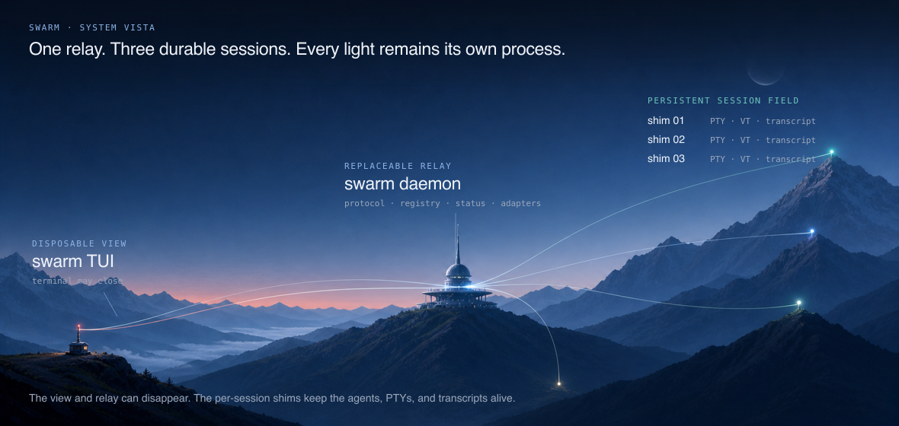
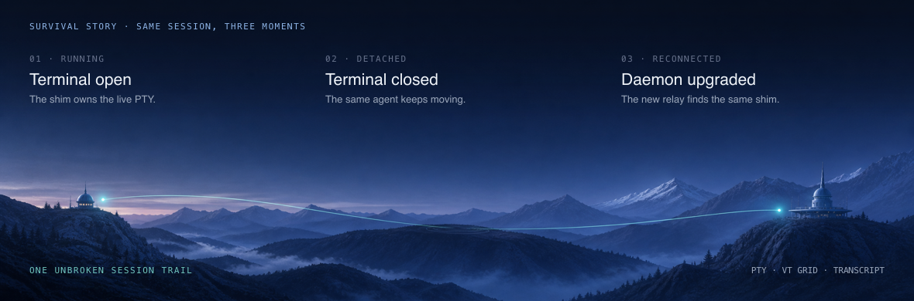
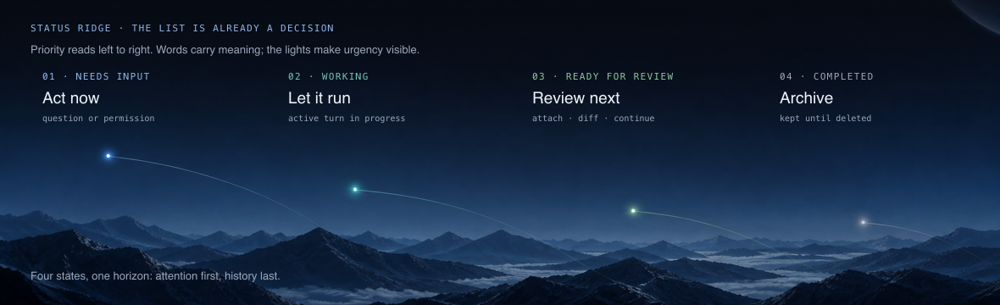
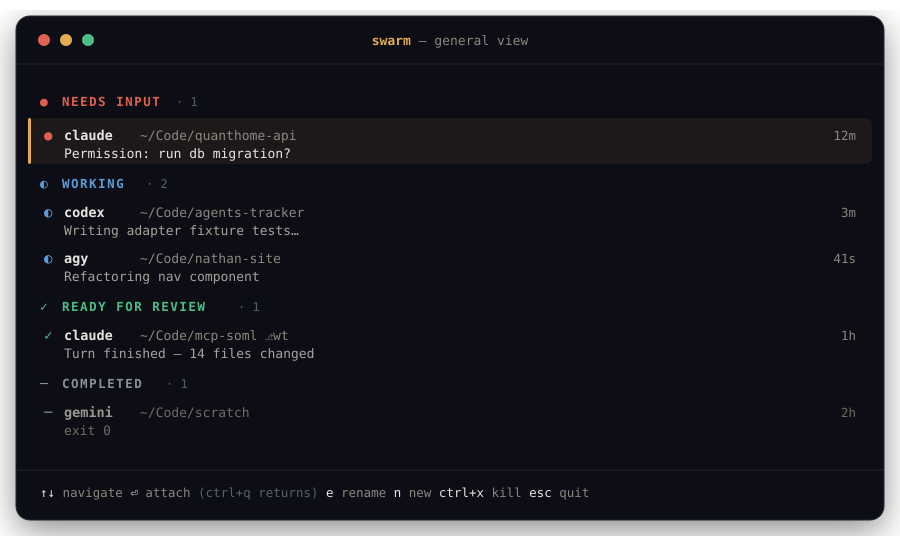

# swarm

<p align="center">
  
</p>

<p align="center"><strong>Every coding agent on your machine. One calm, keyboard-driven view.</strong></p>

<p align="center">
  Run agents in the background, see what needs you, and keep every session alive when the terminal closes or the daemon upgrades.
</p>

<p align="center">
  <a href="https://github.com/Nathandela/swarm/releases"></a>
  <a href="https://go.dev/"></a>
  
  <a href="LICENSE"></a>
</p>

swarm brings Claude Code, Codex, and other coding-agent CLIs into one Agent View-style terminal dashboard. Sessions sort themselves by what they need from you and run under durable per-session supervisors, so closing the wrong tab no longer kills the work.

Inspired by Claude Code's Agent View, but agent-agnostic and open source.

## Why swarm

- **One view for every agent.** Watch supported CLIs from a single board instead of a wall of terminal tabs.
- **Attention comes first.** _Needs input_, _Working_, _Ready for review_, and _Completed_ keep the next human action obvious.
- **Background by default.** Each session owns a real PTY through its own shim process and continues after the TUI exits.
- **Safe daemon upgrades.** Restart or upgrade swarm while agents are running; the replacement daemon finds and reconnects to them.
- **Keyboard-native control.** Launch, attach, rename, hand off work, and stop sessions without leaving the terminal.
- **Remote companion.** The Android app in this repository can securely watch and control agents running on your computer.

## How it works

<p align="center">
  
</p>

One binary plays a few clear roles:

1. `swarm` is the thin terminal client. On first run it starts `swarm daemon` automatically.
2. The daemon owns the protocol, registry, status engine, and CLI adapters.
3. Every agent session gets a tiny **shim** process that owns its PTY, VT screen grid, and transcript.
4. Session metadata is written to disk, allowing a replacement daemon to rebuild the registry and reconnect safely.

Clients never talk to shims directly. Everything crosses the daemon's versioned Unix-socket protocol—the same product spine used by the remote companion.

### Why sessions survive

<p align="center">
  
</p>

The terminal is only a view, and the daemon is replaceable. The per-session shim is the durable process: it keeps the agent, PTY, screen state, and transcript alive. After a restart, the daemon reads each session's `meta.json`, verifies process identity by PID and start time, and reconnects without taking ownership away from the shim.

## Install

swarm ships as a single static binary with no runtime dependencies.

```sh
# Homebrew · macOS
brew install --cask Nathandela/swarm/swarm

# Go · macOS or Linux
go install github.com/Nathandela/swarm/cmd/swarm@latest
```

Or download a signed archive and checksum from the [releases page](https://github.com/Nathandela/swarm/releases). See [docs/install.md](docs/install.md) for platform details and upgrade notes.

```sh
swarm version
```

## Quickstart

```sh
swarm
```

The daemon starts automatically and opens the session board.

| Key | Action |
|---|---|
| <kbd>↑</kbd> <kbd>↓</kbd> | Move through sessions |
| <kbd>⏎</kbd> | Attach to the selected agent; <kbd>ctrl</kbd>+<kbd>q</kbd> returns to swarm |
| <kbd>n</kbd> | Start a session and choose its CLI, working directory, and optional tag |
| <kbd>e</kbd> | Rename the selected session |
| <kbd>t</kbd> | Tag the selected session; an empty tag clears it |
| <kbd>o</kbd> | Options: how the board groups (status, repo, tag) and orders its rows. The choice is remembered across restarts |
| <kbd>h</kbd> | Hand work to another supported CLI |
| <kbd>ctrl</kbd>+<kbd>x</kbd> | Kill a live session or delete a finished one; confirm with <kbd>y</kbd> |
| <kbd>esc</kbd> | Close the TUI while agents keep running |

Attach mode is raw passthrough: the agent's native full-screen interface remains untouched. swarm adds only a thin session header, which can be hidden. Ended sessions offer <kbd>r</kbd> to resume as a fresh linked session where the adapter supports it.

## Status is the interface

<p align="center">
  
</p>

swarm combines process, turn, and interaction signals into one actionable group:

| Group | What it means |
|---|---|
| **Needs input** | The agent asked a question or requested permission. Always sorted first. |
| **Working** | A turn is active. The last meaningful output appears underneath. |
| **Ready for review** | The turn finished. Attach, review the diff, or send the next prompt. |
| **Completed** | The process exited or was lost. It remains until you delete it. |

Structured events are preferred when a CLI exposes them—Claude Code uses configured hooks. Otherwise swarm reads the emulated screen grid and applies adapter-specific detection; it never guesses from arbitrary raw byte fragments.

## The terminal board

<p align="center">
  
</p>

`o` opens the board options: group by status, repository, or tag, and order by arrival, activity, creation, or name. Repository and tag cells stay blocked by status internally — Needs input first, Completed last — so the ordering you pick applies within each status block rather than shuffling an idle session above one waiting on you.

## Bring existing Claude sessions into swarm

Inspect Claude Agent View background sessions that can be adopted:

```sh
swarm reattach --cli claude --all --dry-run
```

Transfer active sessions from Claude's background supervisor to swarm:

```sh
swarm reattach --cli claude --take-over
```

Add `--all` to include completed and stopped sessions. Interactive sessions are never imported. The operation is idempotent: swarm reuses a row with the same native Claude session ID instead of creating a duplicate.

## Supervised handoff

Select a source session at an ordinary prompt or ready for review and press <kbd>h</kbd>. Choose the target CLI, model, and supervision mode. The source writes a context document, launches the linked child, and can monitor it with `swarm watch`, `swarm peek`, and `swarm send`.

```sh
swarm handoff --cli claude --model opus --supervision passive --context-file /tmp/handoff.md
```

Supervision modes:

- `passive` — the daemon notifies the source when the child needs input, becomes ready for review, or completes.
- `manual` — the source agent runs the watch/peek/send loop itself.
- `none` — the source reports the child session ID and leaves supervision to you.

Permission requests are never approved by handoff automation; they remain explicit human decisions.

## Supported agents

| Agent | Status |
|---|---|
| Claude Code | Supported |
| Codex | Supported |
| agy / Antigravity CLI | Supported |
| OpenCode | Supported |
| [Hermes Agent](https://hermes-agent.nousresearch.com/docs/getting-started/installation) | Supported on Apple Silicon macOS and Linux |

Every integration is a self-contained adapter covering detection, spawn arguments, status signals, and resume behavior. Characterization harnesses record real CLI output so adapters are tested against observed behavior rather than assumptions. See the [Hermes adapter evidence](docs/verification/hermes-adapter-evidence.md) for its current upstream limitations.

## Android companion

The Android app pairs with a computer running swarm, displays the same session priorities, and supports encrypted remote observation and control. There is no swarm account: the phone and computer pair directly, and the relay transports encrypted envelopes it cannot read.

The application source lives under [`android/`](android/). Product, privacy, pairing, and self-hosted relay documentation is indexed from [docs/INDEX.md](docs/INDEX.md).

## Upgrading

The daemon keeps running when the binary on disk changes. After an upgrade, move it to the new build with:

```sh
swarm daemon restart
```

Running sessions survive and reconnect by design. See [docs/install.md](docs/install.md) for the complete upgrade path.

## Project status

Public and released—latest [`v0.13.8`](https://github.com/Nathandela/swarm/releases/tag/v0.13.8). Building requires Go 1.25 or newer.

The daemon, per-session shim supervision, TUI, VT emulator, status engine, worktree isolation, production CLI adapters, inter-session handoff, and Android remote-control foundation are implemented and covered by verification evidence under [`docs/verification/`](docs/verification/).

Known limitation: sessions make progress only while the host computer is awake. Sleep pauses agent processes; they resume automatically on wake with their state intact.

## Documentation

- [Documentation index](docs/INDEX.md) — every major document, one hop away
- [System specification](docs/specifications/system-spec.md) — requirements, architecture, and scenarios
- [Build plan](docs/specifications/build-plan.md) — ordered delivery plan and contracts
- [Architecture decisions](docs/adr/) — the decisions behind the process and protocol model
- [UI preview](docs/design/ui-preview.html) — navigable terminal design mockup
- [Brandbook v1](docs/design/swarm-illustration-direction/index.html) — Night Orchestra artwork, logo, icon, palette, and README asset system

## Build and test

```sh
go build ./...
go test ./...
go vet ./...
golangci-lint run
```

All gates must pass before a feature closes. Contributions follow the TDD, evidence, and ADR conventions in [AGENTS.md](AGENTS.md) and [CLAUDE.md](CLAUDE.md).

## License

swarm is licensed under the [MIT License](LICENSE). Bundled third-party components and assets remain subject to their respective license notices.
