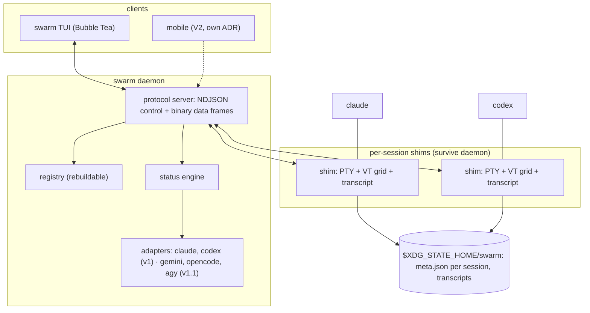
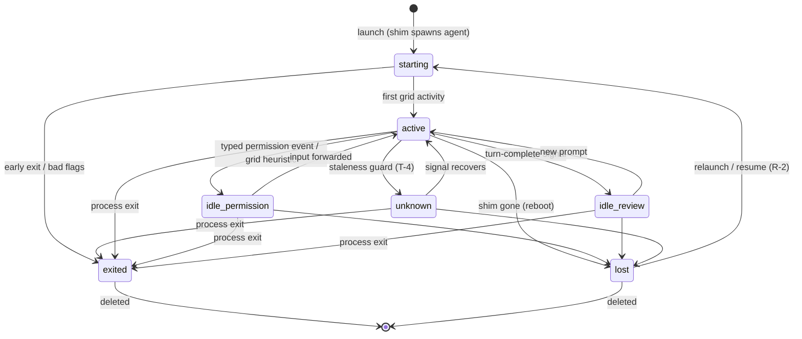
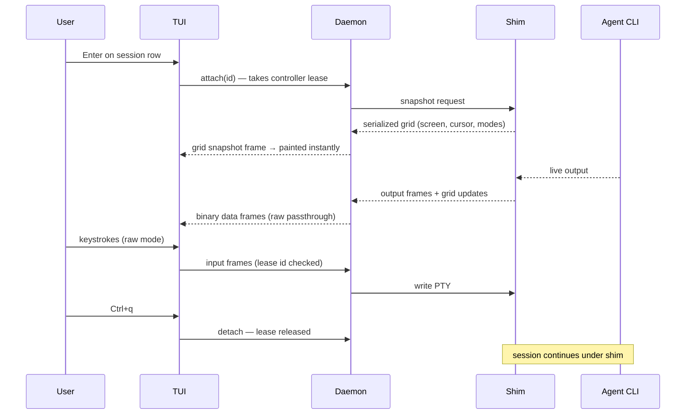

# swarm — System Specification

**Spec ID**: 0001
**Status**: Approved (Gate 2, 2026-07-16)
**Author**: Nathan Delacrétaz (with Claude)
**Created**: 2026-07-16
**Revised**: Draft 2, after audit committee report `docs/verification/audit-001-system-spec.md`

## Goal

`swarm` is a terminal application that centralizes every coding-agent CLI session on a machine into one Agent View-style dashboard: sessions run in the background under a supervisor architecture (surviving terminal close **and daemon crash/upgrade**), are grouped by status, and are launched, attached, and killed entirely by keyboard.

## Context

Inspired by Claude Code's Agent View (see `docs/research/agent_view_landscape.md`), but agent-agnostic. V2 adds mobile remote control; v1 keeps the protocol evolvable for that without claiming remote-readiness (remote needs its own auth/threat-model ADR). The codebase follows the agentic-codebase-manifesto. Four foundational decisions are recorded as ADR-001..004.

## Domain glossary

| Term | Meaning |
|---|---|
| Session | One tracked instance of an agent CLI in a working directory |
| Daemon | Per-user supervisor: registry, protocol server, detection, event fan-out |
| Shim | Tiny per-session process owning the PTY master; survives the daemon (ADR-001) |
| Adapter | Per-CLI module: detection, spawn args, options schema, status signals, resume |
| Roster | Rebuildable on-disk index of sessions; per-session metadata is the truth (ADR-003) |
| General view | TUI home screen listing sessions grouped by status |
| Attach / Detach | Full-screen raw PTY passthrough / return to general view |
| Client | Anything speaking the daemon protocol (TUI now, mobile in V2) |
| Grid | The VT-emulated screen state (cells, cursor, modes) a shim maintains per session |

## Process architecture (ADR-001)

```
client (TUI) ── UDS, control+data protocol ── daemon ── per-session UDS ── shim ── PTY ── agent CLI
```

- The **shim** owns: PTY master, VT emulator (grid), transcript append, a per-session socket.
- The **daemon** owns: roster, launch/kill orchestration, adapters, status engine, client protocol, event fan-out. Clients never talk to shims directly.
- Daemon crash or upgrade: shims and agents continue; a restarting daemon rediscovers shims from per-session metadata and reconnects. Nothing is lost.

## Session status model

Three orthogonal dimensions (audit finding: one enum conflates unrelated facts):

- **process**: `running` | `exited(code)` | `lost` (shim/process gone, e.g. reboot)
- **turn**: `active` (agent computing) | `idle` (waiting on user) | `unknown` (detection inconclusive or stale)
- **interaction**: `none` | `prompt` (free-text input expected) | `permission` (approval requested) | `unknown`

Derived view groups:

| Group | Rule |
|---|---|
| Needs input | running ∧ idle ∧ (permission ∨ prompt-after-question) |
| Working | running ∧ (active ∨ turn unknown, marked `?`) |
| Ready for review | running ∧ idle ∧ turn-completed |
| Completed | exited ∨ lost |

## EARS Requirements

### Daemon and shim lifecycle (D)

- **D-1** (Event) WHEN any `swarm` client command runs and no daemon is alive, swarm SHALL start the daemon detached (setsid, stdio to log file) and connect, transparently.
- **D-2** (Ubiquitous) Each session's PTY master SHALL be owned by a dedicated shim process, not by the daemon; sessions SHALL be independent of any terminal and of the daemon's lifetime.
- **D-3** (Event) WHEN the terminal that launched swarm closes, running sessions SHALL continue unaffected.
- **D-4** (Event) WHEN the daemon starts, it SHALL rebuild its registry from per-session metadata, reconnect to live shims, and mark sessions whose shim is gone as `lost` — verifying process identity by PID **plus process start time** (PID-reuse safe).
- **D-5** (Unwanted) IF the daemon crashes or is upgraded, THEN running sessions SHALL continue under their shims and be reconnectable by the next daemon with no data loss.
- **D-6** (Ubiquitous) The daemon socket SHALL live under a 0700 state directory with 0600 permissions; a restarting daemon SHALL take a flock-based singleton lock **before** binding and unlink stale sockets only under that lock.
- **D-7** (Unwanted) IF a second daemon instance starts, THEN it SHALL fail to take the lock and exit; the client that spawned it SHALL retry connecting to the winner (bounded backoff).
- **D-8** (Event) WHEN client and daemon protocol versions are incompatible at handshake, swarm SHALL surface a clear error and offer `swarm daemon restart` — which is safe (D-5) and SHALL say so.
- **D-9** (Ubiquitous) The daemon SHALL keep a single durable append-only event journal (session lifecycle and status-group transitions), fsync'd before each cursor is acked and surviving a crash/upgrade (D-5); and every **remote** mutating operation SHALL be idempotent, keyed by an `operation_id` whose durable two-phase record makes a replay return the cached outcome and execute nothing. ADR-007 is the authority on the journal, idempotency, and remote-access model.

### Sessions (S)

- **S-1** (Event) WHEN the user submits the launch form, the daemon SHALL spawn a shim which execs the agent CLI in a fresh PTY in the requested working directory, with adapter-composed **argv arrays only** (no shell interpretation of any user-supplied field), in its own process group.
- **S-2** (Ubiquitous) Each session SHALL persist: id, agent type, working directory, launch options, captured environment, created-at, status dimensions, last-activity, shim PID + start time, agent-native conversation id when the adapter exposes one, exit code when ended, `schema_version`.
- **S-3** (Optional, later epic) WHERE the worktree toggle was enabled at launch, the daemon SHALL create a git worktree under `.swarm/worktrees/<id>` (validated id; error if not a git repo; named branch `swarm/<id>`), and SHALL tear it down (`git worktree remove` + prune) when the session is deleted.
- **S-4** (Event) WHEN the user kills a session, the shim SHALL signal the agent's **process group** (SIGTERM, grace, SIGKILL) so descendant processes (MCP servers, shells) do not leak; outcome recorded.
- **S-5** (Ubiquitous) The shim SHALL maintain the session's VT grid (emulated screen: cells, cursor, alternate-screen, modes) and an append-only transcript with a size cap and rotation; repeated redraw frames (spinners) SHALL be collapsed before hitting disk.
- **S-6** (Ubiquitous) The launch RPC SHALL carry the client's environment (allowlist-filtered); the shim SHALL spawn the agent with that environment, never the daemon's inherited one.
- **S-7** (Ubiquitous) The daemon SHALL enforce a configurable max concurrent session count and reject launches over it with a clear inline error.

### Client protocol (P) (ADR-002)

- **P-1** (Ubiquitous) Client-daemon communication SHALL use one UDS connection carrying two planes: a **control plane** (newline-delimited JSON-RPC-style messages, versioned, capability-negotiated at handshake) and a **data plane** (length-prefixed binary frames for PTY bytes), multiplexed with defined framing and a max frame size.
- **P-2** (Ubiquitous) Control operations: handshake, list, launch, kill, delete, attach/detach, resize, subscribe. Data frames: PTY input, PTY output, grid snapshot.
- **P-3** (Event) WHEN a session's status dimensions change, the daemon SHALL push an event to all subscribed clients; a slow or dead subscriber SHALL be disconnected (bounded outbound queue), never blocking PTY draining or persistence.
- **P-4** (Unwanted) IF a client disconnects mid-attach, THEN the session continues and the daemon releases the stream and lease cleanly.
- **P-5** (Ubiquitous) Attach SHALL use an **exclusive controller lease** (input + resize authority, lease generation id on every input/resize message; stale-lease messages rejected). One controller per session in v1; observer mode is a later capability.
- **P-6** (Ubiquitous) The daemon SHALL re-validate every client-supplied input server-side (paths, options, ids) regardless of client checks.

### General view (V)

- **V-1** (Ubiquitous) The general view SHALL list all sessions grouped as Needs input / Working / Ready for review / Completed (derivation table above).
- **V-2** (Event) WHEN a status event arrives, the general view SHALL reflect it within 1 second without user action.
- **V-3** (Ubiquitous) Navigation SHALL be keyboard-only: ↑/↓ (and j/k) move selection across groups, Enter attaches, Esc backs out/quits, Ctrl+X kills (one-key confirm), `n` opens the launch form.
- **V-4** (Ubiquitous) Each row SHALL show: agent name, working directory (shortened), status, elapsed/last-activity time, and a one-line last-output summary derived heuristically from the grid (no LLM call).
- **V-5** (Event) WHEN a session enters Needs input or Ready for review, the general view SHALL surface an in-TUI notification (highlight + transient banner). OS notifications are v1.x.
- **V-6** (Ubiquitous) The aesthetic SHALL be minimal, Claude Code-like: no mouse required, subtle color, no decoration without information.

### Launch flow (L)

- **L-1** (Ubiquitous) The launch form SHALL collect: working directory (free text, `~` expansion), agent (from detected CLIs), model/options rendered from the adapter's **declarative options schema**, optional initial prompt, worktree toggle (when the epic ships).
- **L-2** (Ubiquitous) The agent picker SHALL offer only CLIs detected on PATH (with version check against the adapter's supported range); supported-but-missing CLIs appear greyed with an install hint.
- **L-3** (Unwanted) IF the working directory does not exist or is not a directory, THEN the form SHALL show an inline error and refuse to launch (and the daemon re-validates, P-6).

### Attach (A)

- **A-1** (Event) WHEN the user attaches, the TUI SHALL enter raw mode (IXON off) full-screen passthrough: every keystroke forwarded except the detach key; ANSI output rendered untouched (alternate screen, colors, cursor control — N-6).
- **A-2** (Ubiquitous) The detach key SHALL default to `Ctrl+q` (configurable), returning to the general view while the session continues. (Revised from `Ctrl+\` per ADR-006: `Ctrl+\` is near-untypeable on Swiss/QWERTZ/AZERTY layouts; `Ctrl+q` is layout-friendly and, since raw mode clears IXON per A-1, its XON byte carries no flow-control collision.)
- **A-3** (Event) WHEN the controlling client's terminal resizes, the daemon SHALL propagate the size to the session PTY (resize authority follows the attach lease, P-5).
- **A-4** (Event) WHEN attaching, the client SHALL receive a **serialized grid snapshot** (current emulated screen, both buffers, cursor, modes) followed by the live stream — never raw historical bytes, never a blank screen.
- **A-5** (Ubiquitous) Attach chrome SHALL be at most one thin line (session name + detach hint), toggleable off.

### Adapters and status detection (T)

- **T-1** (Ubiquitous) Each supported agent SHALL be described by an adapter implementing one interface: binary detection + version range, launch-arg composition, declarative options schema (so the TUI renders options without code changes, keeping T-5 honest), status signal sources, resume capability + native conversation-id extraction.
- **T-2** (Ubiquitous) Status detection SHALL prefer **typed signals** wherever the CLI offers them: Claude Code hooks (PermissionRequest/Notification/Stop), Codex app-server / typed events, Gemini CLI structured hooks, OpenCode plugin events (`permission.asked`, `session.idle`). Hook/callback delivery to the daemon SHALL be authenticated with a per-session token; hook installation SHALL be per-invocation (flags/env/project-local), never a non-atomic mutation of the user's global config.
- **T-3** (Ubiquitous) Grid-based heuristics (reading the emulated screen, never the raw byte stream) SHALL be the fallback for CLIs or states without typed signals; evaluated on output events with a low-frequency fallback poll.
- **T-4** (Unwanted) IF detection is inconclusive, or no output AND no process CPU activity occurs for a threshold while turn=`active`, THEN turn SHALL become `unknown` (staleness guard: never confidently wrong).
- **T-5** (Ubiquitous) Adding a new adapter SHALL require no changes to daemon core, protocol, or TUI.
- **T-6** (Ubiquitous) BEFORE an adapter is built, a **characterization harness** SHALL record the CLI's real behavior (PTY fixtures per state, hook/event payloads, version) into the fixture corpus; the adapter's capability-matrix entry (signals, resume, options) is the harness's output and the adapter's acceptance baseline.
- **T-7** (Ubiquitous) v1.0 ships Claude Code and Codex adapters; Gemini CLI, OpenCode, and AGY follow (AGY only after characterization — currently unscoped).

### Persistence (R) (ADR-003)

- **R-1** (Ubiquitous) State SHALL live under `$XDG_STATE_HOME/swarm` (fallback `~/.local/state/swarm`), 0700: `sessions/<id>/meta.json` (source of truth, atomic temp+rename writes, `schema_version`) + transcript files (0600, capped, rotated); `roster.json` is a rebuildable index only.
- **R-2** (Optional) WHERE an adapter supports resume and a native conversation id was captured (S-2), an ended/lost session SHALL offer relaunch-with-resume as a **new session** linked via `resumed_from`.
- **R-3** (Ubiquitous) Completed sessions SHALL remain listed until the user deletes them (Ctrl+X on a completed row deletes; deletion tears down worktrees per S-3 when present).

### Non-functional (N)

- **N-1** TUI first paint SHALL be < 100 ms with the daemon running and ≤ 50 sessions listed (p95, Apple Silicon / modern x86).
- **N-2** Attach passthrough SHALL add < 10 ms added local latency p95 (measured keystroke→PTY write).
- **N-3** The daemon and shims SHALL be event-driven with no busy polling; PTYs are always drained (a full PTY buffer must never block an agent), spinner churn is collapsed before disk, and client-idle CPU is near zero.
- **N-4** Distribution SHALL be a single static binary (CGO_ENABLED=0) per platform (macOS arm64/x86_64, Linux x86_64/arm64) via Homebrew tap and `go install`; zero runtime dependencies (no tmux). The binary contains client, daemon, and shim roles.
- **N-5** The repository SHALL follow the agentic-codebase-manifesto reference architecture (vendored in `docs/governance/`).
- **N-6** Attach SHALL pass through alternate screen, colors, and cursor control faithfully; mouse passthrough optional for v1. Terminal-escape hygiene: OSC 52 clipboard writes and similar hostile sequences are filtered in the snapshot path.
- **N-7** Known accepted limitation: machine sleep pauses agents (all architectures); a caffeinate-style keep-awake is a possible v1.x option.

### V2-forward constraints (F)

- **F-1** The protocol SHALL be versioned and capability-negotiated from the first release; messages carry an endpoint id and namespaced session ids so multi-daemon clients need no schema break.
- **F-2** Remote transport (mobile, relay, multi-machine) is **not** claimed v1-ready: it requires its own ADR covering identity, pairing/auth, E2EE/relay trust, reconnect cursors, and idempotency. v1's obligation is only: no UDS-specific assumptions in message schemas.

## Architecture diagrams

### System context



### Session lifecycle (process × turn × interaction, illustrative)



### Attach (sequence)



## Scenario table

| # | Given | When | Then | Reqs |
|---|---|---|---|---|
| 1 | No daemon running | User runs `swarm` | Daemon auto-starts; view < 100 ms after daemon up | D-1, N-1 |
| 2 | Launch form, valid dir | Pick claude + model, Enter | Shim spawns agent, appears under Working | S-1, L-1, V-1 |
| 3 | Session working | Terminal closed | Agent keeps running; reopening swarm shows it | D-2, D-3 |
| 4 | Claude session running | Claude requests permission | needs_input ≤ 1 s via authenticated hook; row highlighted + banner | T-2, P-3, V-2, V-5 |
| 5 | Codex session running | Turn lifecycle event fires | Status from typed event, not parsing | T-2 |
| 6 | Any session, no typed signal | CLI idle at prompt | Grid heuristic flags idle; staleness guard prevents false working | T-3, T-4 |
| 7 | Session selected | Enter | Grid snapshot painted instantly, typing reaches agent | A-1, A-4, P-5 |
| 8 | Attached | Ctrl+q | Back to general view; session continues | A-2 |
| 9 | Attached | Terminal resized | Agent reflows (lease holds resize authority) | A-3, P-5 |
| 10 | Sessions running | Daemon killed -9, restarted | Shims kept agents alive; daemon reconnects; nothing lost | D-4, D-5 |
| 11 | Sessions running | `brew upgrade swarm` + daemon restart | Same as 10 — upgrade is safe and says so | D-5, D-8 |
| 12 | Machine rebooted | swarm reopened | Sessions marked lost, transcripts intact, resume offered where supported | D-4, R-2 |
| 13 | Launch form | Nonexistent dir | Inline error; daemon re-validates too | L-3, P-6 |
| 14 | gemini not installed | Launch form opened | Greyed with install hint | L-2 |
| 15 | Spinner runs overnight | — | Transcript capped/rotated; near-zero client-idle CPU | S-5, N-3 |
| 16 | Second client attaches | — | Lease refused/transferred explicitly; stale input rejected | P-5 |
| 17 | Agent spawns MCP servers | Kill session | Whole process group terminated, nothing leaks | S-4 |
| 18 | Launch from terminal with venv + API key | Agent runs | Agent sees the launching terminal's environment | S-6 |

## Constraints

- Go ≥ 1.22, Bubble Tea; PTY via creack/pty; VT emulation via an established Go library (hinted: vt10x-class) — evaluated in ADR-002 work, never hand-rolled parsing in adapters.
- Argv-array spawning only; no shell string composition anywhere (ADR-004).
- Protocol and on-disk schema are low-reversibility: changes require an ADR.
- Adapters are the high-volatility zone: signal rules live per-adapter, backed by the characterization fixture corpus (T-6); core never contains CLI-specific logic.

## Out of scope (v1)

OS notifications (v1.x), mobile/remote transport + auth (V2, own ADR), multi-machine (V2), Windows, mouse passthrough, observer attach mode, session sharing, sandboxing, keep-awake (v1.x candidate).
